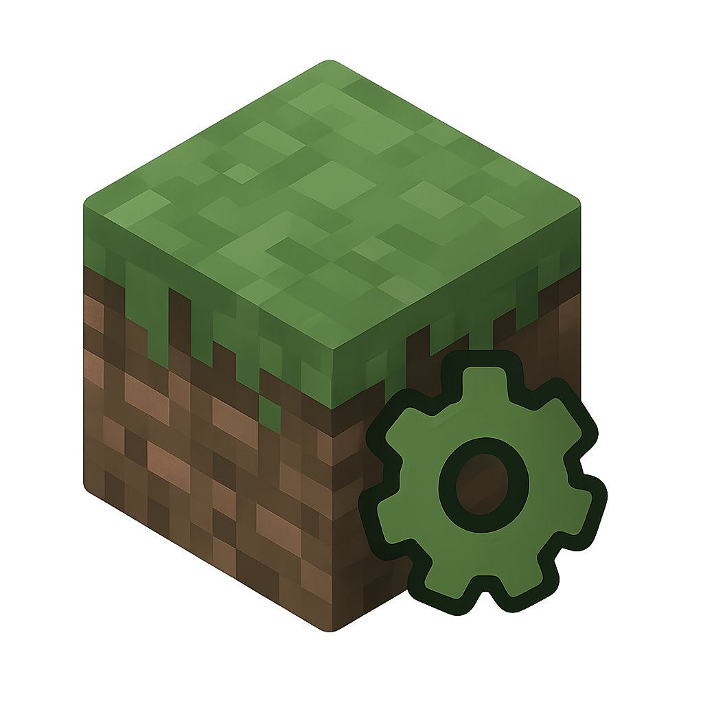

# Minecraft Core

A comprehensive Minecraft Server and Client Management Application built with Electron and Svelte.

## 🚀 Features

### 🖥️ Server Management
- **Complete Server Control** - Start, stop, restart your Minecraft server with one click
- **Real-time Console** - Monitor server logs and execute commands directly
- **Performance Metrics** - Track CPU, RAM, and disk usage in real-time
- **Auto-restart System** - Configurable crash detection and automatic server restarts
- **Server Properties Editor** - Easy-to-use interface for modifying server settings
- **Java Management** - Automatic Java detection and version management
- **Port Configuration** - Flexible port and RAM allocation settings

### 👤 Client Management
- **Minecraft Client Setup** - Automated client installation and configuration
- **Server Connection** - Easy setup for connecting to your managed servers
- **Profile Management** - Multiple client instance support
- **Authentication** - Microsoft account integration for legitimate gameplay

### 📦 Mod Management
- **Universal Mod Support** - Compatible with Forge, Fabric, and Quilt mods
- **Automatic Installation** - One-click mod installation from popular repositories
- **Dependency Resolution** - Automatic handling of mod dependencies
- **Compatibility Checking** - Real-time mod compatibility validation
- **Manual Mod Support** - Drag-and-drop installation for custom mods
- **Server-Client Sync** - Ensure client and server mods are synchronized

### 💾 Backup System
- **Automated Backups** - Schedule regular world and configuration backups
- **Manual Backups** - Create instant backups before major changes
- **Backup Management** - Easy restore and cleanup of old backups
- **Compression** - Efficient storage with automatic compression

### 🔧 Advanced Features
- **Multi-Instance Support** - Manage multiple server and client instances
- **System Tray Integration** - Run minimized in system tray
- **Auto-Updates** - Built-in application update system
- **Player Management** - Monitor connected players and their activity
- **Settings Persistence** - All configurations saved automatically
- **Cross-Platform** - Windows support with planned Linux/macOS compatibility

## 🚀 Installation

### Pre-built Releases
1. Download the latest release from the [Releases](https://github.com/zXord/Minecraft-Core/releases) page
2. Run the `Minecraft-Core-Setup-${version}.exe` installer
3. Follow the installation wizard
4. Launch Minecraft Core from your desktop or start menu

## 🏗️ Project Structure

This project follows a structured organization to maintain clarity and ease of development. For a detailed explanation of the directory layout and file organization, see [docs/PROJECT_STRUCTURE.md](docs/PROJECT_STRUCTURE.md).

Key directories:
- `src/` - Frontend Svelte application
- `electron/` - Electron main process code
- `scripts/` - Build and utility scripts
- `config/` - Configuration files
- `shared/` - Code shared between renderer and main processes
- `build-resources/` - Source files for building installers
- `docs/` - Project documentation

## 🛠️ Development Setup

To run the project locally:

1. Install Node.js 22.12 or newer
2. Install dependencies with `npm install`
3. Start the development app with `npm run dev`
4. Run tests with `npm test`
5. Build production assets with `npm run build`

## 🐛 Bug Reports

Found a bug? Please open an issue with:
- Operating system and version
- Steps to reproduce
- Expected vs actual behavior
- Screenshots if applicable

## 💡 Feature Requests

Have an idea? We'd love to hear it! Open an issue with:
- Clear description of the feature
- Use case or problem it solves
- Any implementation ideas

## 📊 Stats

