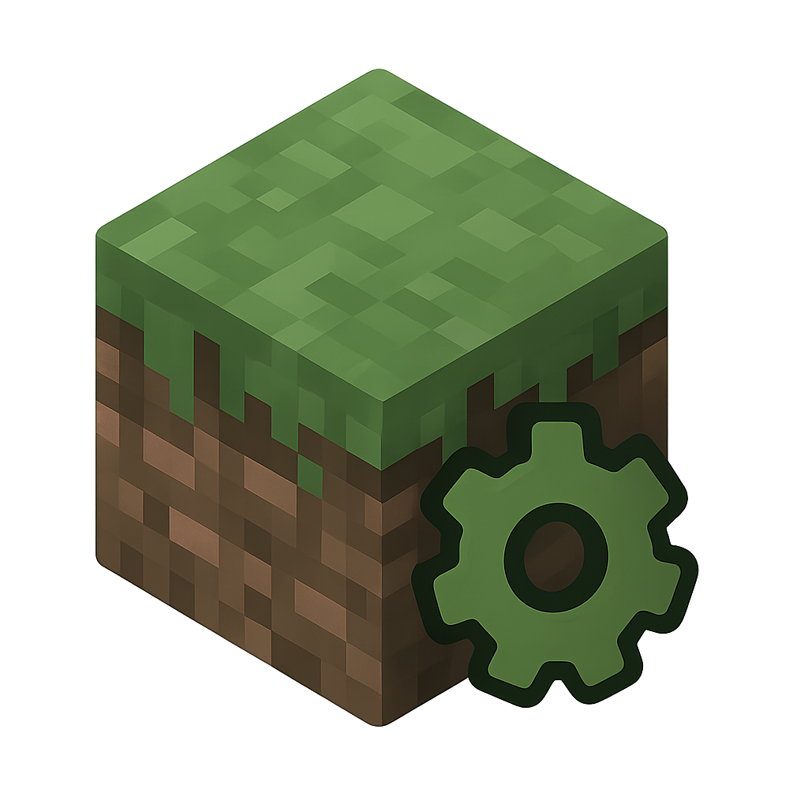

This README is written with AI assistance and I am bored to read it, so take it with a grain of salt. And this app as well xD
# Minecraft Core

A comprehensive Minecraft Server and Client Management Application built with Electron and Svelte.



## 🚀 Features

### 🖥️ Server Management
- **Complete Server Control** - Start, stop, restart your Minecraft server with one click
- **Real-time Console** - Monitor server logs and execute commands directly
- **Performance Metrics** - Track CPU, RAM, and disk usage in real-time
- **Auto-restart System** - Configurable crash detection and automatic server restarts
- **Server Properties Editor** - Easy-to-use interface for modifying server settings
- **Java Management** - Automatic Java detection and version management
- **Port Configuration** - Flexible port and RAM allocation settings

### 👤 Client Management
- **Minecraft Client Setup** - Automated client installation and configuration
- **Server Connection** - Easy setup for connecting to your managed servers
- **Profile Management** - Multiple client instance support
- **Authentication** - Microsoft account integration for legitimate gameplay

### 📦 Mod Management
- **Universal Mod Support** - Compatible with Forge, Fabric, and Quilt mods
- **Automatic Installation** - One-click mod installation from popular repositories
- **Dependency Resolution** - Automatic handling of mod dependencies
- **Compatibility Checking** - Real-time mod compatibility validation
- **Manual Mod Support** - Drag-and-drop installation for custom mods
- **Server-Client Sync** - Ensure client and server mods are synchronized

### 💾 Backup System
- **Automated Backups** - Schedule regular world and configuration backups
- **Manual Backups** - Create instant backups before major changes
- **Backup Management** - Easy restore and cleanup of old backups
- **Compression** - Efficient storage with automatic compression

### 🔧 Advanced Features
- **Multi-Instance Support** - Manage multiple server and client instances
- **System Tray Integration** - Run minimized in system tray
- **Auto-Updates** - Built-in application update system
- **Player Management** - Monitor connected players and their activity
- **Settings Persistence** - All configurations saved automatically
- **Cross-Platform** - Windows support with planned Linux/macOS compatibility

## 📋 Requirements

- **Operating System**: Windows 10/11 (Linux and macOS support planned)
- **Node.js**: Version 16 or higher (for development)
- **Java**: Java 8+ (automatically managed for Minecraft servers)
- **RAM**: Minimum 4GB recommended (more for larger servers)
- **Storage**: At least 2GB free space for Minecraft files

## 🚀 Installation

### Pre-built Releases
1. Download the latest release from the [Releases](https://github.com/zXord/Minecraft-Core/releases) page
2. Run the `Minecraft-Core-Setup-${version}.exe` installer
3. Follow the installation wizard
4. Launch Minecraft Core from your desktop or start menu

### Development Setup

```bash
# Clone the repository
git clone https://github.com/zXord/Minecraft-Core.git
cd minecraft-core

# Install dependencies
npm install

# Start development server
npm run dev

# Build for production
npm run build

# Package for distribution
npm run dist
```

## 🎮 Quick Start

### Setting Up Your First Server

1. **Launch Minecraft Core** and click the sidebar toggle (☰)
2. **Add Instance** → Select "Server Instance"
3. **Choose Server Folder** - Select or create a folder for your server
4. **Select Minecraft Version** - Choose your preferred server version
5. **Configure Settings** - Set port, RAM allocation, and other preferences
6. **Start Server** - Click the start button and wait for initialization

### Setting Up a Client

1. **Add Instance** → Select "Client Instance"
2. **Choose Client Folder** - Select installation directory
3. **Server Connection** - Enter your server IP and port
4. **Install Client** - The app will download and configure Minecraft
5. **Launch Game** - Connect to your server and start playing!

### Managing Mods

1. Navigate to the **Mods** tab
2. **Search and Install** - Browse mod repositories or drag-and-drop files
3. **Dependency Management** - The app handles all mod dependencies automatically
4. **Client Sync** - Ensure client mods match server requirements
5. **Compatibility Check** - Verify all mods work together

## 🔧 Configuration

### Server Settings
- **Port**: Default 25565, customize as needed
- **RAM**: Allocate based on your system capabilities
- **Auto-restart**: Configure crash detection and restart behavior
- **Backups**: Set automatic backup schedules

### Client Settings
- **Server Connection**: IP address and port configuration
- **Performance**: Graphics and performance optimization
- **Mod Preferences**: Enable/disable specific mods

### Application Settings
- **Window Size**: Choose from presets or set custom dimensions
- **System Tray**: Configure minimize-to-tray behavior
- **Auto-updates**: Control automatic application updates
- **Start Behavior**: Set startup preferences

## 📁 Project Structure

```
minecraft-core/
├── electron/           # Electron main process
│   ├── ipc/           # IPC handlers for communication
│   ├── services/      # Background services
│   └── utils/         # Utility functions
├── src/               # Svelte frontend
│   ├── components/    # UI components
│   ├── routes/        # Main application routes
│   ├── stores/        # State management
│   └── utils/         # Frontend utilities
├── public/            # Static assets
└── dist/              # Built application
```

## 🛠️ Development

### Available Scripts

- `npm run dev` - Start development server with hot reload
- `npm run build` - Build for production
- `npm run start` - Start Electron app
- `npm run pack` - Package app without distribution
- `npm run dist` - Build and package for distribution

### Tech Stack

- **Frontend**: Svelte 5, CSS3, Lucide Icons
- **Backend**: Electron, Node.js, Express
- **Minecraft Integration**: XMCL libraries, Minecraft Protocol
- **Storage**: Electron Store, File System APIs
- **Build**: Vite, Electron Builder

## 🤝 Contributing

We welcome contributions! Please see our contributing guidelines:

1. Fork the repository
2. Create a feature branch (`git checkout -b feature/amazing-feature`)
3. Commit your changes (`git commit -m 'Add amazing feature'`)
4. Push to the branch (`git push origin feature/amazing-feature`)
5. Open a Pull Request

### Development Guidelines
- Follow ESLint configuration
- Write clear commit messages
- Test your changes thoroughly
- Update documentation as needed

## 📄 License

This project is licensed under the MIT License - see the [LICENSE](LICENSE) file for details.

## 🐛 Bug Reports

Found a bug? Please open an issue with:
- Operating system and version
- Steps to reproduce
- Expected vs actual behavior
- Screenshots if applicable

## 💡 Feature Requests

Have an idea? We'd love to hear it! Open an issue with:
- Clear description of the feature
- Use case or problem it solves
- Any implementation ideas

## 📞 Support

- **GitHub Issues**: [Report bugs or request features](https://github.com/zXord/Minecraft-Core/issues)
- **Discussions**: [Community discussions and questions](https://github.com/zXord/Minecraft-Core/discussions)

## 🙏 Acknowledgments

- **Minecraft** - Mojang Studios
- **XMCL** - Excellent Minecraft launcher libraries
- **Electron** - Cross-platform desktop app framework
- **Svelte** - Reactive UI framework
- **Community** - All contributors and users

## 📊 Stats


---

**Made with ❤️ for the Minecraft community** 